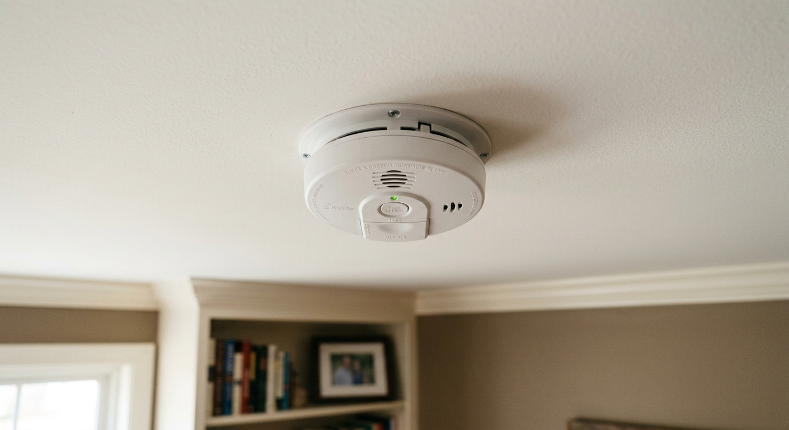

# smoke-detector
Problem Statement:

In our school, there has been an increasing problem with students smoking secretly in school. This issue is particularly concerning for several reasons, including health risks, violation of school policies, and the influence it may have on other students.

Our Solution:

Install our smoke detector(SD). When the sensor detects a smoking smoke, it will light the warning led in our phone.

our team:

Name: Yap Zhong Herng/Class: 1L

Name: Hiram/Class: 2s

Name: Teng Zhen Nam/Class: 2s

We had bring this project to a competition which is call the young innovators challenge 2024

In this project, we learned the importance of teamwork. The key element of working in a team of this project is Responsibility.  Each of our member has specific roles and responsibilities, contributing to the team's success. Although the work is tough, as long as we have companions to do it together, no matter how hard the task is, it will become easier.

